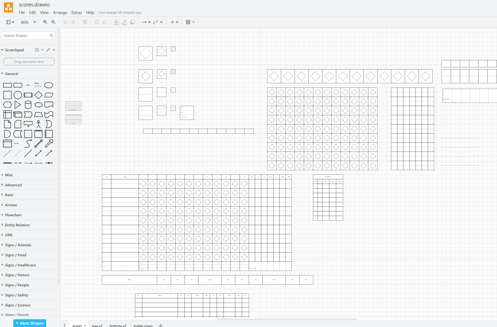

## There's a warm breeze in the air...

I love baseball. A lot. I love the stats, the history, a cold beer on a hot day (or, in Seattle's case, a very cold night), the scream of the crowd during a close play at the plate. It's like nothing else.

My dad and I travel to a different ballpark each summer to follow God's Chosen Team, the Colorado Rockies, to an away game. The first year we did this, we went to Dodger Stadium, where our $50 Chavez Ravine parking came with a game program and scorebook. I very clearly remember my voice jumping up an octave when I asked my dad, "Do you want to keep score?"

I've done it almost every game since.

Every so often, I look at scorecards I fill out and I compare them to scorecards from a hundred years ago, and they look more or less the same. There's just this little slice of immortality to the practice.

But then comes the math. I really loved the [Eephus League Halfliner](https://eephusleague.com/product/the-halfliner/) (indeed, I still do, and I'd recommend it to anyone looking for a good scorebook), but its box score didn't have strikeouts on the hitter's column. That bothered me enough I set out to design my own.

After three years of painstakingly drawing, re-drawing, and play testing designs, I settled on this one as "good enough" to print out in a full 81-page notebook. I used [Mixam](https://mixam.com/) for that job, since they seemed to be the most effective at printing large spiral-bound books, but it's just as good to swing by a Kinko's on your way to the ballpark and print one page out from the PDF.

I spent a lot of time thinking about monetizing this, but I realized that open-sourcing it makes a lot more sense because this game is about love, not money.

I'm opening a section of my [projects page](https://csanford.cloud/projects/scorecard/) to track this effort. Because I'm rushing it up prior to opening day, it's a little bare now, but it'll get spruced up soon. In the meantime, you can download the resources [on my GitHub](https://github.com/cisanford/baseball).
